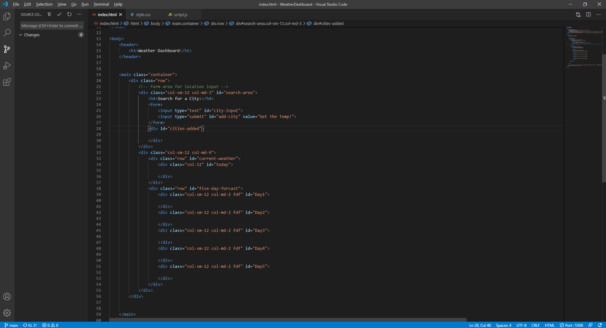
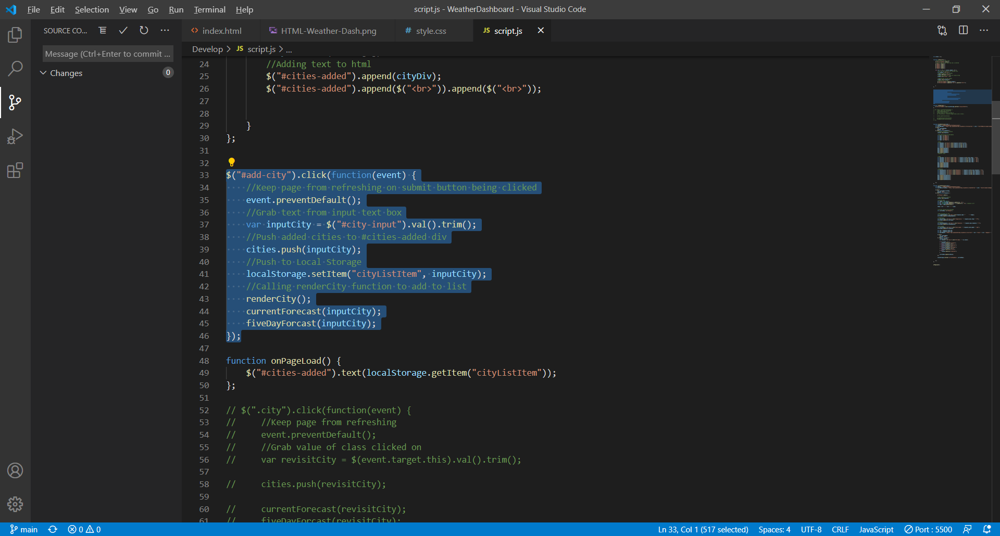
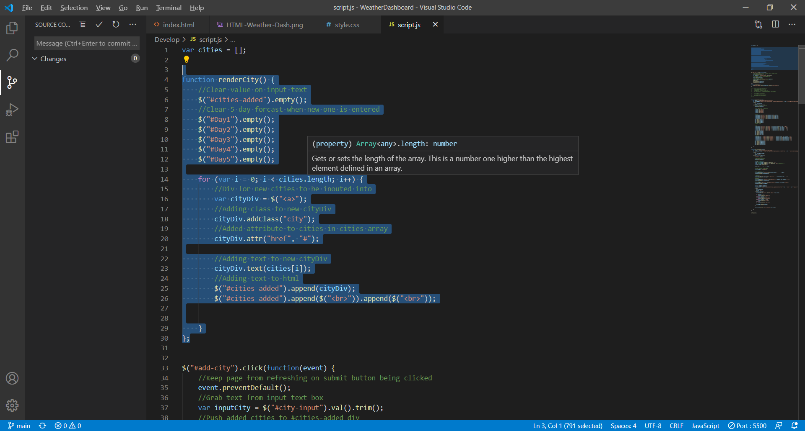
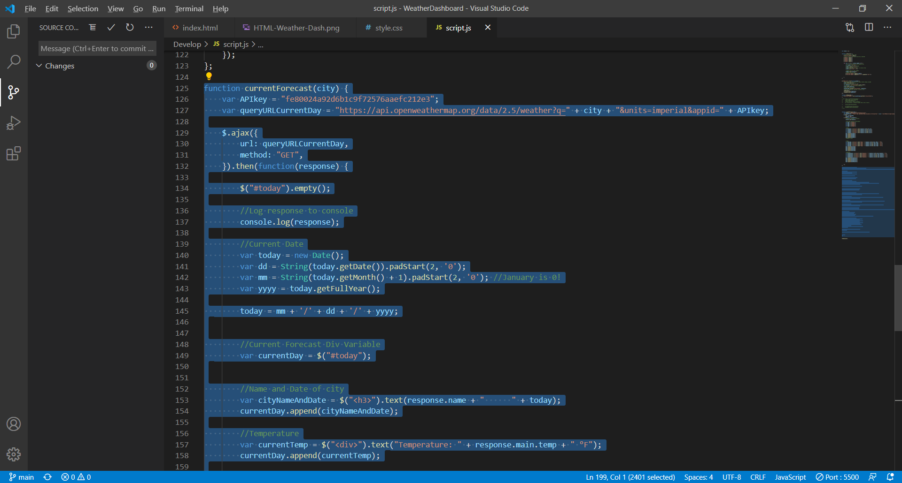
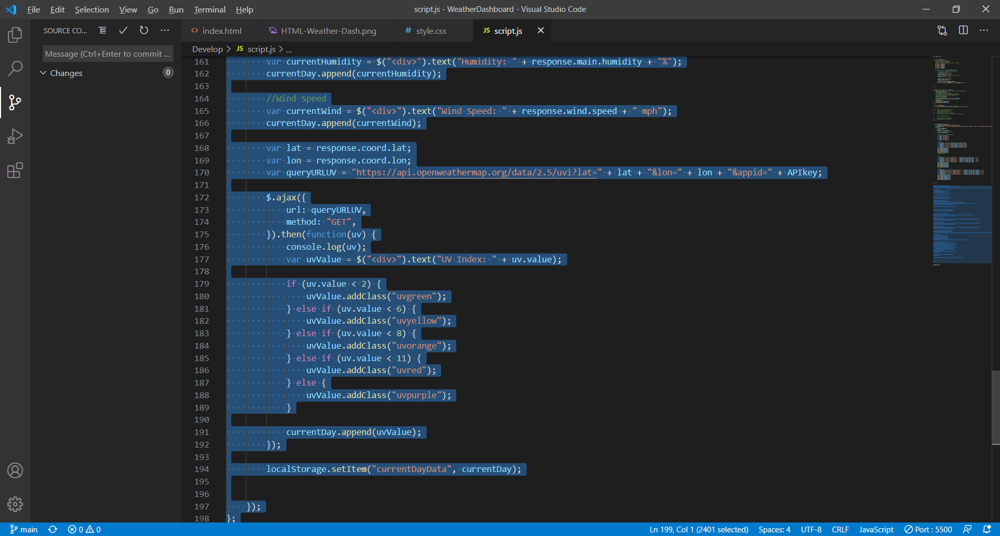
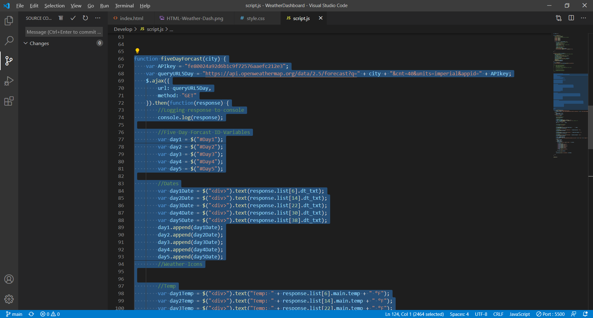
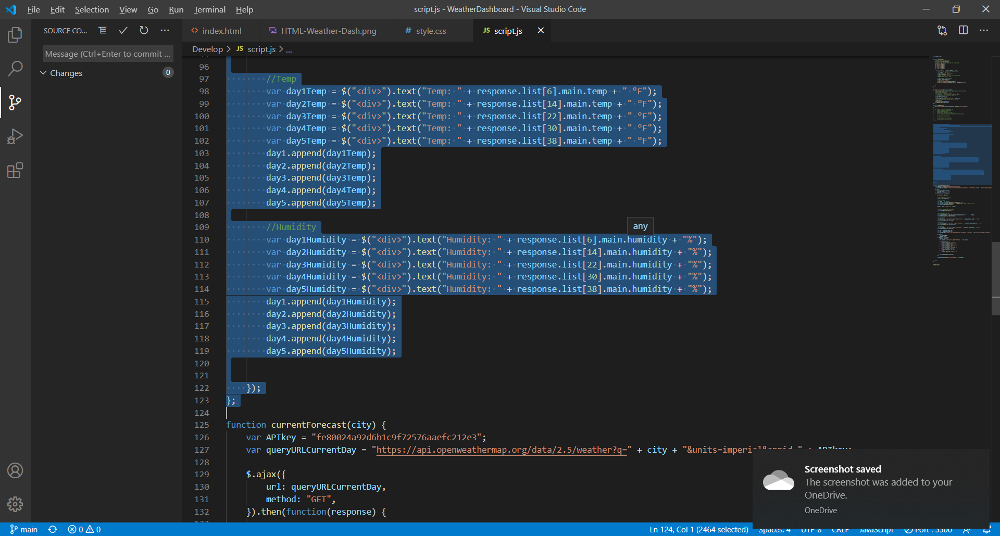
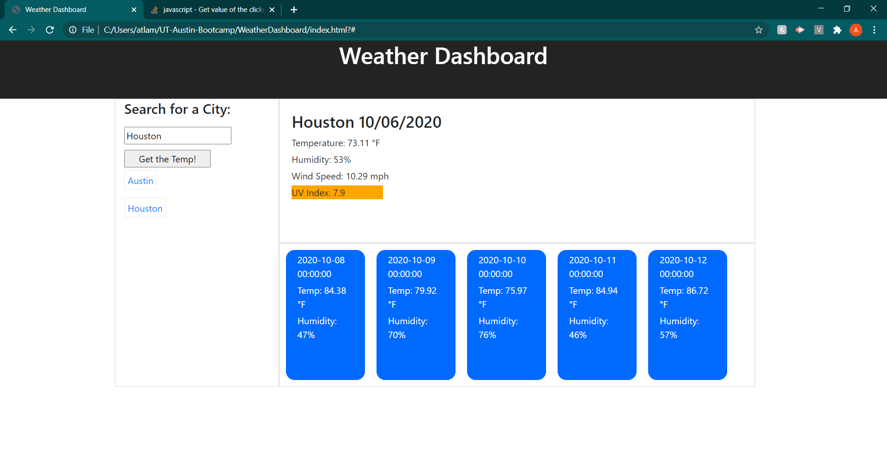

# WeatherDashboard

This week, we were tasked with creating a weather dashboard. This dashboard was required to include the current weather, and a 5 day forecast. The current weather was to include the temperature, humidity, wind speed, and the UV index, while the 5 day forecast included the date, temperature, humidity, and a weather icon. We were also suppsoe to create list that documented our previous choices. This list would allow us to also go back and look at the data of previous choices.

## HTML

I decided to create a pre-existing HTML frame, rather than generating most of it through Javascript. While I still generate most of the weather data through Javascript, I thought it was simpler to have existing HTML to add that into.

## Javascript

Here I'll show the step by step process of how I gathered the data on screen

First I made a click event that would gather the value of whatever city I typed into the input text box. I made sure to add a .preventDefault() function so that the page would not refresh. I then pushed the value to an emty array to be used later. I then saved the value to loal storage so that it would stay when the page refreshed. From there the click event called 3 functions that I set.

The first function called by my click event was the renderCity() function. This function created an anchor tag that contained the value of the text input, and displayed it on screen in a lsit of other entered values. This function also emptied all of my pre-existing divs in my html so that only the current selected weather data was printed on the screen.

The next function, called currentForecast(), took the name of the city entered and pulled weather data pertaining t taht city from the Open Weather Map API. The function added information regarding the date, city name, current temperature, current humidity, current wind speed, and trhe UV index. The UV index was also pulled from a seperate ajax call taht was nestled into the first.

After that the fiveDayForcast() function grabbed data regarding the date, temperature, and humidity that was to be expected in the next five days. I made sure to append this data as 5 seperate divs, each containing the appropriate info for the five following days.

## Final Result

This is a screen shot of my final results

### Link

https://auslam212.github.io/WeatherDashboard/

